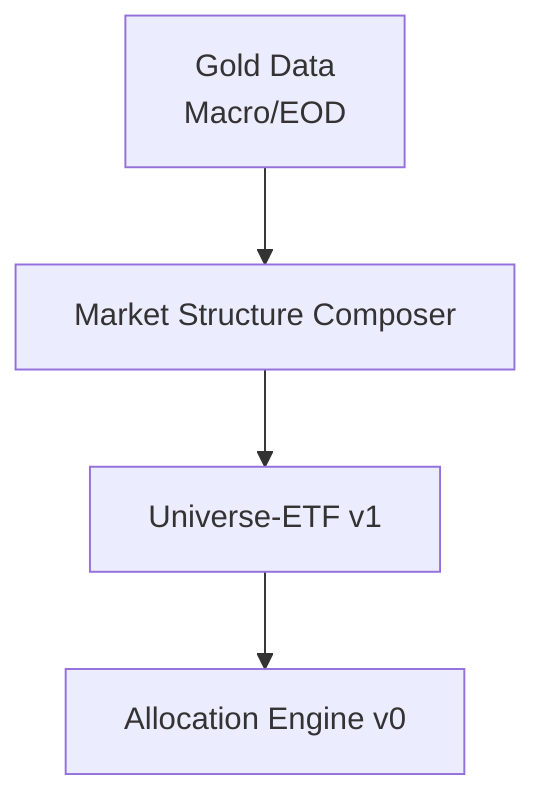

# 📄 Universe-ETF Design Document

Markers: architecture, contract, legacy
Status: reference


**프로젝트:** Pretrend — Reproducible Market Data Platform
**문서:** Universe-ETF Design
**Version:** 2026.02.12 (재분류: 2026-05-12)
**목적:** Universe-ETF(v1) 역할/입력/출력 정의

> ⚠️ **Reference — ETF SOT는 현재 유효, 후보 선택 로직은 보관**
>
> 본 문서가 정의하는 Universe-ETF v1은 두 성격을 함께 가진다:
> - **현재 유효한 데이터 자산**: ETF 후보 풀(SOT 32 ETFs), asset_group/subtype 라벨, EOD Observability 입력 정합
> - **보관된 실행 실험 맥락**: "후보를 선별하는" picking 로직(RS 기반 상위 N 선정 등)
>
> 현재 운영 기준은 ETF SOT와 라벨 계약을 read-only data asset으로 사용하는 것이다.
>
> 참조: [`track_separation.md`](track_separation.md), [`eod_observability_contract.md`](eod_observability_contract.md)

---

## 1. Overview

본 문서는 Universe-ETF(v1)의 설계 목적과 동작 경계를 정의한다.
Universe-ETF는 독립 전략 엔진이 아니라,
`Market Structure Composer` 결과를 입력으로 받아
Observability ETF 집합 내 후보를 선별하는 **read-only 소비 모듈**이다.

참고:
- `Universe-Stock(U0~U3)`는 별도 로드맵 파이프라인이며 본 문서 범위 밖이다.
- 관련 로드맵: `docs/roadmap/milestones.md`

참조 문서:
- `docs/architecture/strategy_architecture.md`
- `docs/architecture/market_structure_composer_contract.md`
- `docs/architecture/universe_contract.md`
- `docs/architecture/eod_observability_contract.md`
- `docs/architecture/allocation_engine_contract.md`

---

## 2. Universe-ETF Pipeline Structure (v1)



핵심 원칙:
- Universe-ETF는 Composer 출력만 의존한다.
- Universe-ETF는 Observability 라벨을 변경하지 않는다.
- Allocation은 Universe-ETF 결과를 소비하되, v0에서 총 투자비율만 조절한다.

---

## 3. 범위와 제외 범위

### 3.1 Scope
- 대상 자산: Observability ETF 세트
- 입력: Composer 상태 벡터 + Gold EOD Feature
- 출력: 후보 리스트(`is_candidate`)와 상대 강도 지표

### 3.2 제외 범위
- 개별 종목(싱글네임) 선별
- 점수 가중치/컷오프 수치 최적화
- Universe-ETF 내부 종목 비중 조절(v0 범위 밖)

---

## 4. Inputs

### 4.1 Composer 입력 (필수)

| 컬럼 | 타입 | 필수 | 설명 |
| --- | --- | --- | --- |
| trade_date | DATE | Y | 기준일 |
| long_phase | TEXT | Y | 장기 상태 |
| mid_regime | TEXT | Y | 중기 상태 |
| short_signal | TEXT | Y | 단기 상태 |
| run_universe | BOOLEAN | Y | Universe-ETF 실행 여부 |
| risk_gate | BOOLEAN | Y | Allocation 증가 허용 신호 |

### 4.2 Gold EOD 입력 (필수)

| 컬럼 | 타입 | 필수 | 설명 |
| --- | --- | --- | --- |
| symbol | TEXT | Y | ETF 심볼 |
| trade_date | DATE | Y | 기준일 |
| asset_group | TEXT | Y | Observability 그룹 |
| asset_name | TEXT | Y | canonical 라벨 |
| asset_subtype | TEXT | N | 세부 라벨 |
| eod feature columns | FLOAT/TEXT | Y | 상대 비교에 필요한 EOD 파생값 |

---

## 5. Processing (개념 설계)

1. Composer 게이트 확인
- `run_universe=false`이면 빈 결과를 반환한다.

2. 입력 정합성 확인
- 동일 `trade_date` 기준 데이터만 사용한다.
- Observability 라벨 컬럼 누락 시 해당 레코드는 제외 또는 오류 처리한다(구현 계약에 따름).

3. 후보 계산
- asset_group/asset_name 기준 그룹 내 상대 비교를 수행한다.
- 출력은 `is_candidate` 중심으로 제공한다.

4. Allocation 연계
- Universe-ETF는 후보 집합만 제공한다.
- 투자 비율 조절은 Allocation Engine v0가 수행한다.

---

## 6. Outputs

### 6.1 출력 스키마

| 컬럼 | 타입 | 필수 | 설명 |
| --- | --- | --- | --- |
| rebalance_date | DATE | Y | 리밸런스 기준일 |
| symbol | TEXT | Y | ETF 심볼 |
| asset_group | TEXT | Y | 그룹 라벨 |
| relative_strength | FLOAT | Y | 상대 강도(정의는 계약 문서 기준) |
| is_candidate | BOOLEAN | Y | 후보 여부 |

### 6.2 출력 예시

```yaml
rebalance_date: 2026-02-28
candidates:
  - symbol: XLK
    asset_group: SECTOR
    relative_strength: 0.71
    is_candidate: true
  - symbol: TLT
    asset_group: BOND
    relative_strength: 0.42
    is_candidate: false
```

---

## 7. Invariants

- Observability 라벨(`asset_group`, `asset_name`, `asset_subtype`)은 read-only다.
- `run_universe=false`이면 결과는 비어야 한다.
- Universe-ETF는 Composer 하위 모듈(long/mid/short)을 직접 참조하지 않는다.
- v0에서 Universe-ETF는 비중 배분을 결정하지 않는다.

---

## 8. Integration with Layer / Allocation

- Layer:
  - Gold Macro/Gold EOD가 Universe-ETF 입력의 상위 데이터 소스다.
- Allocation Engine v0:
  - Universe-ETF 후보 리스트를 소비한다.
  - `risk_gate=false`일 때는 증가 차단 규칙을 적용한다.
  - 총 투자비율 조절만 수행하며, Universe-ETF 내부 비중은 조절하지 않는다.

---

## 9. Roadmap (Universe-ETF 관점)

- v0: 후보 집합 산출 + Allocation 분리
- v1: 변동성 인지형 후보 안정화 로직(계약 문서 확정 후)
- v2: 레짐 연계 강화(Composer 상태 벡터 활용 확대)
- v3: 그룹별 동적 가중치(Allocation 확장 범위)

Stock 유니버스 확장은 `Universe-Stock(U0~U3)` 로드맵으로 관리하며, 본 문서가 아니라 `docs/roadmap/milestones.md`를 기준으로 한다.
