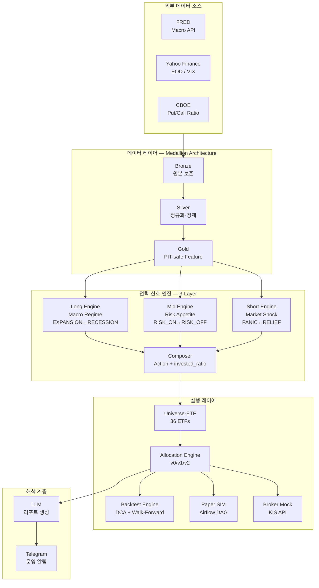

# Pretrend AI — System Overview (Legacy / Personal Track 동결)

Markers: legacy, architecture
Status: legacy

> ⚠️ **LEGACY — Personal Track 동결 자산 설명**
>
> 본 문서는 2026Q2 방향 재정의 이전의 Personal Track 자동매매 파이프라인 설명이다.
> Personal Track은 2026-05-12에 운영 중단되었고 신규 기능 추가는 영구 금지된다.
> 현재 프로젝트 entry point는 [docs/system_overview.md](../system_overview.md) (Observability Runtime)다.

**Version:** 2026.03.11 (Personal Track 동결 시점)
**Project:** Pre-Trend Value 기반 ETF 포트폴리오 시스템 — Personal Track (동결)
**Author:** Ethan

> ⚠️ **2026Q2 방향 재정의 — 본 문서는 Personal Track(동결) 자산을 설명합니다.**
>
> 본 프로젝트는 **Market Structure Observability Runtime**으로 재정의되었다.
> 본 문서가 설명하는 Strategy Engine / Backtest / Paper / Broker 체계는 **Personal Track으로 분리되어 동결 + 운영 중단 상태**다 (2026-05-12~, 신규 기능 추가 금지).
>
> Observability Track 신규 작업 방향은 다음 문서를 우선 참조한다:
> - [`docs/architecture/track_separation.md`](../architecture/track_separation.md) — 트랙 분리 원칙
> - [`.agent/REFACTOR_2026Q2.md`](../../.agent/REFACTOR_2026Q2.md) — 리팩토링 계획 (Phase 0~3)

---

## 한 줄 요약 (Legacy)

> 거시 경제 Regime을 3-Layer 신호 엔진으로 해석하고, ETF 포트폴리오를 자동으로 조정하는
> 계약 기반(contract-driven) ETF 자산 배분 시스템. Backtest → Paper → Mock 3단계 검증을 거쳐 운영 중. **(Personal Track, 동결)**

---

## 1. 왜 만들었는가

전통적인 자동매매 시스템이 개별 종목 분석이나 단기 가격 예측에 집중하는 것과 달리,
이 시스템은 **거시 경제 사이클(Macro Regime)을 중심으로 자산 배분 비율을 자동 조정**하는 것을 목표로 설계됐다.

핵심 전제:
- 단기 가격 예측보다 **장기 Regime 감지가 더 안정적인 알파**를 만든다.
- ML 모델의 비결정성보다 **규칙 기반 엔진의 재현성**이 운영 신뢰성에 유리하다.
- LLM은 의사결정이 아닌 **해석과 보고 계층**으로만 사용한다.

→ 관련 설계 결정: [ADR-002](../adr/ADR-002-rule-based-signal-engine.md), [ADR-005](../adr/ADR-005-llm-interpretation-layer.md)

---

## 2. 전체 시스템 구성



---

## 3. 레이어별 설계 설명

### 3.1 데이터 레이어 — Medallion Architecture

Bronze → Silver → Gold 3단계로 데이터를 처리한다.

| 레이어 | 역할 | 핵심 원칙 |
|---|---|---|
| Bronze | 외부 원본 데이터 그대로 저장 | 변환 금지, 원본 보존 |
| Silver | 정규화, 결측치 처리, 이상치 필터 | Bronze read-only consumer |
| Gold | PIT-safe 파생 피처 계산 | Silver read-only consumer, `selected_release_date < trade_date` 보장 |

**PIT(Point-in-Time) 정합성**이 핵심 불변식이다.
FRED 거시 지표는 발표일과 기준일이 다르기 때문에(vintages),
Gold에서 `econ_events → fred_vintages → assumed_t+1` 3단계 fallback으로
미래 데이터 누출을 원천 차단한다.

수집 데이터:
- **Macro (FRED)**: CPI, UNRATE, Fed Funds Rate, 10Y Treasury — 2006~현재
- **EOD (Yahoo Finance)**: 36 ETF + `^VIX` — 2004~현재
- **Put/Call (CBOE)**: Equity P/C, Total P/C — 2004~현재 (구현 중)

→ 관련 설계 결정: [ADR-001](../adr/ADR-001-medallion-data-architecture.md)

---

### 3.2 전략 신호 엔진 — 3-Layer Market Structure

시장 상태를 **서로 다른 시간 차원의 3개 독립 레이어**로 판단한다.

```
Long Engine  (장기, 수개월)  → FRED 거시 delta_6m rolling z-score
Mid Engine   (중기, 수주)    → 가격 모멘텀 + 거시 정책 방향 + IWM-SPY breadth
Short Engine (단기, 수일)    → 일별 수익률/변동성 + 보조 신호 5개 (v1.2: VIX 추가)

Composer                     → Long + Mid + Short → action + next_invested_ratio + risk_gate
```

**설계 핵심**: 3개 레이어는 독립적으로 실패한다(Fail-open).
FRED 데이터가 지연되면 Long Engine이 `UNKNOWN`을 반환하지만
Mid/Short Engine은 정상 작동한다. 단일 신호 구조에서는 불가능한 설계다.

**실증 검증 결과**:

| 이벤트 | Long | Mid | Short | 판정 |
|---|---|---|---|---|
| GFC 2009-03-09 | RECESSION | RISK_OFF | PANIC | ✅ 3개 레이어 모두 감지 |
| COVID 2020-03 | RECESSION | RISK_OFF | PANIC | ✅ 정확 포착 |
| Rate Hike 2022 | LATE_CYCLE | NEUTRAL | NORMAL | ✅ 과도한 방어 없이 적절 반응 |

→ 관련 설계 결정: [ADR-003](../adr/ADR-003-three-layer-market-structure.md)

---

### 3.3 실행 레이어 — Universe-ETF + Allocation Engine

**Universe-ETF**: 36개 ETF를 5개 자산군(SECTOR/BOND/COMMODITY/COUNTRY/INDEX)으로 관리.
Core(SPY, SCHD, IAU)는 항상 보유. Tactical은 Composer 신호 기반으로 Relative Strength 상위 선정.

**Allocation Engine**: Composer의 `next_invested_ratio`를 실제 포트폴리오 목표 비율로 변환.

| Preset | 전략 | 특성 |
|---|---|---|
| v0 | Range-maintenance [10~60%] | 최고 Sharpe(1.76), 최저 MDD(-11.18%) |
| v1 | Target-seeking f(long_phase) | GFC 역발상 매수, 균형 전략 |
| v2 | 2D lookup f(long_phase, mid_regime) | XIRR 최고(+8.00%), 2022 금리인상기 +11.5% |

→ 관련 설계 결정: [ADR-004](../adr/ADR-004-etf-based-execution-universe.md)

---

### 3.4 Backtest Engine — 다층 검증 구조

단순 수익률 비교가 아닌 **실운영 조건을 반영한 Backtest**를 구현했다.

- **주간 매매 사이클**: 월요일 신호 평가 / 화요일 매수 / 금요일 단계 매도(3주 분할)
- **DCA($300/월)**: 월 첫 거래일 자금 주입 + Benchmark 병렬 추적
- **SCHD 전환**: 2011년 SCHD 출시 전 DVY/VIG → 3-tranche staged transition
- **Walk-Forward**: 4년 창 × 2년 슬라이드 × 9개 창 — 구간별 성능 안정성 검증
- **Conditional Slice Analysis**: 8개 시장 국면 × 2개 정책 비교 (v3.4.1 vs SCHD floor-20)

**Backtest v2 검증 결과 (2006-01-03 ~ 2024-06-03, Short Engine v1.1 기준)**:

| 지표 | v2 (이 시스템) | SPY Buy & Hold |
|---|---|---|
| XIRR | **+7.25%** | +8.59% |
| Max Drawdown | **-15.65%** | -24.08% |
| Sharpe Ratio | **1.68** | 1.49 |
| Calmar Ratio | **1.99** | 1.32 |
| GFC MDD | **-15.71%** | -17~29% |
| COVID MDD | **-12.55%** | -12~30% |
| Rate Hike 2022 | **+11.5%** | -7.6~9.2% |

*SPY 대비 절대수익은 낮지만, MDD와 Sharpe/Calmar에서 우위.*

---

### 3.5 실행 계층 분리 — Backtest → Paper → Mock → Live

전략을 실 매매로 연결하는 경로를 4단계로 분리하여 각 단계에서 독립적으로 검증한다.

```
Backtest Engine  → 전략 로직 유효성 (2006~현재 전 구간)
Paper SIM        → 실시간 신호 정확성 (가상 자본, 실 시장 데이터)
Broker Mock      → KIS API 연동 신뢰성 (가상 체결, 실 계좌 구조)
Live             → Out-of-scope (별도 승인 전까지)
```

**현재 운영 상태**:
- Paper SIM + Broker Mock: Airflow DAG 자동 실행 중
- Broker Mock: ET 09:40 (NYSE 개장 10분 후) 자동 체결 시도
- SCHD floor 20% NAV 정책: SIM/Mock 동일하게 적용
- Telegram 알림: 전략 실행 결과 자동 전송

→ 관련 설계 결정: [ADR-006](../adr/ADR-006-execution-tier-hierarchy.md)

---

### 3.6 LLM 해석 계층 — 의사결정 분리 원칙

LLM은 전략 판단의 **결과물을 설명**하는 역할만 수행한다.
매매 신호 생성이나 의사결정에 관여하지 않는다.

```
[규칙 기반 신호 엔진] → action + Phase + Regime
                              ↓
                    [LLM 해석 계층]
                    - 전략 근거 자연어 설명
                    - 주간 리포트 작성
                    - 리서치 요약 (예정)
```

이 결정의 핵심 이유: LLM의 비결정성이 Backtest 재현성을 훼손하면
Backtest 검증의 신뢰성 자체가 무너진다.

→ 관련 설계 결정: [ADR-005](../adr/ADR-005-llm-interpretation-layer.md)

---

## 4. 운영 인프라

| 컴포넌트 | 내용 |
|---|---|
| 서버 | Ubuntu + RTX 4090 (로컬 GPU 서버) |
| 오케스트레이션 | Airflow (systemd, 재부팅 자동 복구) |
| 자동 실행 DAG | macro_pipeline (09:00 UTC), eod_pipeline (08:00 UTC), strategy_engine (10:00 UTC) |
| 알림 | Telegram Bot (전략 실행 완료 + 매매 결과 자동 발송) |
| 테스트 | pytest 671 passed (전체 파이프라인 커버리지) |
| 데이터 저장 | Parquet + Hive-compatible 파티션 (로컬 Data Lake) |
| 버전 관리 | Git (main/dev 브랜치), Changelog 관리 |
| 브로커 API | KIS (한국투자증권) Mock / Live API |

---

## 5. 검증 체계 요약

| 검증 단계 | 방법 | 결과 |
|---|---|---|
| 전 구간 Backtest | 2006-01-03 ~ 2024-06-03, v0/v1/v2 preset | Sharpe 1.68, Calmar 1.99, MDD -15.65% |
| Walk-Forward | 4년 창 × 2년 슬라이드 × 9개 창 | Mean CAGR +3.99%, Mean MDD -10.75% |
| Conditional Slice Analysis | 8개 국면 슬라이스 × 2개 정책 비교 | defensive_stress, transition_risk_high에서 floor 우세 |
| 실증 이벤트 검증 | GFC/COVID/Rate Hike 구간 신호 확인 | 3개 레이어 모두 정확 감지 |
| Paper Trading | 실시간 신호 생성 및 가상 매매 | 운영 중 |
| Broker Mock | KIS Mock API 실제 주문 흐름 | 운영 중 |

---

## 6. 현재 개발 단계 및 다음 단계

### 완료된 것
- Medallion 데이터 파이프라인 (Macro + EOD, 2006~현재)
- 3-Layer 전략 신호 엔진 (Long v1 / Mid v1.1 / Short v1.1)
- Backtest v0/v1/v2 + Walk-Forward + Slice Analysis
- Paper SIM + Broker Mock 운영 자동화
- Airflow 오케스트레이션 + systemd 운영

### 진행 중
- VIX 신호 추가 (Short Engine v1.2 — `^VIX` backfill 완료, step 연구 진행 중)
- CBOE Put/Call Ratio 파이프라인 (macro_pipeline 편입)

### 다음 단계
1. **FastAPI 서비스 레이어**: strategy snapshot / market state 조회 endpoint
2. **Observability**: health endpoint, metric 수집
3. **LLM 해석 계층 구조화**: prompt versioning, fallback, cost cap 정책 공식화
4. **Universe-Stock (U0~U3)**: 거시 신호 기반 종목 Research Universe (M2 마일스톤)

---

## 7. 핵심 설계 원칙 요약

| 원칙 | 적용 |
|---|---|
| **Contract-driven** | 레이어 간 인터페이스를 계약 문서로 고정. 구현보다 계약이 우선. |
| **PIT Compliance** | 모든 피처는 해당 거래일 이전 정보만 사용. 미래 데이터 누출 원천 차단. |
| **Fail-open** | 데이터 부재 시 `UNKNOWN` 반환, 시스템 계속 작동. |
| **Reproducibility** | 동일 입력 → 동일 출력. Backtest와 실운영 비교 가능. |
| **Idempotency** | 파이프라인 재실행 시 항상 동일 결과. |
| **LLM Boundary** | LLM은 해석 계층으로만. 의사결정 체인에서 분리. |

---

## 관련 문서

- **설계 결정 근거 (ADR)**: [`docs/adr/`](../adr/README.md)
- **전략 아키텍처 상세**: [`docs/architecture/strategy_architecture.md`](../architecture/strategy_architecture.md)
- **전체 아키텍처**: [`docs/architecture.md`](../architecture.md)
- **전략 엔진 SOT**: [`docs/architecture/strategy_engine_design.md`](../architecture/strategy_engine_design.md)
- **운영 가이드**: [`docs/operation_guide.md`](../operation_guide.md)
- **마일스톤**: [`docs/roadmap/milestones.md`](../roadmap/milestones.md)
