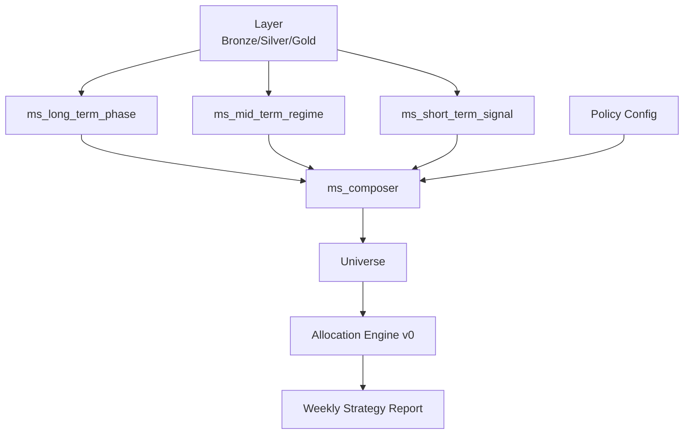

# Pretrend AI — 전략 아키텍처 정리 (Risk-Control 중심 구조)

## Document Status
| Item | Value |
| --- | --- |
| Status | Active |
| Structure Policy | 구조는 고정, 기능은 확장 |
| Effective Date | 2026-02-13 |
| Change Tracking | docs/changelog.md |

## Capability Matrix
| Capability | Status | Notes |
| --- | --- | --- |
| Core scope | Active | 본 문서의 계약/설계 범위 |
| Extension ports | Reserved | v1+ 확장 포트는 인터페이스만 정의 |
| Numeric scoring/tuning | Not supported | 본 문서 범위에서 금지 |

## TOC
- [1. 문서 목적](#1-문서-목적)
- [2. 전체 전략 아키텍처](#2-전체-전략-아키텍처)
- [3. 모듈별 책임 분리](#3-모듈별-책임-분리)
  - [3.1 Layer](#31-layer)
  - [3.2 Market Structure (분리 모듈 + 합성)](#32-market-structure-분리-모듈--합성)
  - [3.3 Universe](#33-universe)
  - [3.4 Allocation Engine v0](#34-allocation-engine-v0)
- [4. 4개 축 전략 철학 (재료 관점)](#4-4개-축-전략-철학-재료-관점)
- [5. 실행 흐름](#5-실행-흐름)
- [6. Non-Goals](#6-non-goals)

참조 계약 문서:
- `docs/architecture/gold_design_contract.md`
- `docs/architecture/calendar_design_contract.md`
- `docs/architecture/eod_observability_contract.md`
- `docs/architecture/allocation_engine_contract.md`
- `docs/architecture/policy_config_contract.md`
- `docs/market_structure_data_inventory.md`

## 1. 문서 목적
### 책임
- Risk-Control 중심 전략 구조를 정의한다.
- `Layer -> Market Structure -> Composer -> Universe -> Allocation Engine` 흐름 채택 이유를 명시한다.
- 전략 철학(Design)과 검증 가능한 스키마/불변식(Contract) 분리 원칙을 고정한다.

### Non-goals
- 점수 가중치/컷오프/수치 기준 정의
- 구현 코드 상세 정의

## 2. 전체 전략 아키텍처
### 책임
- 데이터/판단/실행 흐름을 표준 파이프라인으로 고정한다.
- Market Structure를 단일 모듈이 아닌 3개 분리 모듈 + Composer 구조로 명시한다.

### Non-goals
- 모듈 내부 계산식/튜닝 규칙 명세



모듈별 역할 요약:

| 모듈 | 핵심 역할 | 전략 판단 포함 |
| --- | --- | --- |
| Layer | 데이터 수집/정제/PIT-safe 확정 | 아니오 |
| Market Structure(분리+합성) | 장/중/단기 상태 해석 + 합성 상태 벡터 제공 | 예 |
| Universe | 후보 ETF 선별 | 부분적 |
| Allocation Engine v0 | 총 투자 비율 조절(`invested_ratio`) + risk gate 적용 | 예 |
| Weekly Report | 주간 결과 요약/설명 | 아니오 |

## 3. 모듈별 책임 분리
### 3.1 Layer
#### 책임
- 사실 데이터 저장 및 정규화, PIT-safe 입력 확정을 수행한다.
- Gold Macro/Gold EOD를 통해 판단 모듈이 사용할 입력을 제공한다.

#### Non-goals
- 시장 국면 해석, 후보 선별, 매수/매도 판단을 수행하지 않는다.

### 3.2 Market Structure (분리 모듈 + 합성)
#### 책임
- 해석 원칙: 4축(정책/매크로, 가격/변동성, 수급/구조, 심리)은 상태 판단의 근거 데이터 축이며, long/mid/short는 이 4축을 서로 다른 관측 시점(horizon)으로 해석하는 모듈이다.
- `ms_long_term_phase`: 장기 사이클 위치 판단
- `ms_mid_term_regime`: 중기 레짐 판단
- `ms_short_term_signal`: 단기 흐름/심리/스트레스 신호 판단
- `ms_composer`: long/mid/short 출력을 단일 상태 벡터로 합성해 Universe/Allocation 입력으로 제공
- 핵심 원칙: Universe/Allocation은 개별 모듈을 직접 참조하지 않고 Composer 출력만 의존

#### Non-goals
- 장/중/단기 모듈 간 가중치 수치화
- 포트폴리오 구성 비중 결정

### 3.3 Universe
#### 책임
- Observability ETF 집합 내에서 후보를 선별한다.
- Composer 결과를 반영하여 후보 집합을 제한한다.
- 전략 판단은 최소화하고 후보 집합 생성에 집중한다.

#### Non-goals
- Market Structure 하위 모듈 재계산/직접 참조
- Universe 내부 가중치 조절을 수행하지 않는다(v0 금지).

### 3.4 Allocation Engine v0
#### 책임
- 주기별 총 투자 비율(`invested_ratio`)을 조절한다.
- 입력: Composer 출력에서 `target_invested_range(lower, upper)`, `adjustment_limit`, `risk_gate`를 소비하고, 별도로 `current_invested_ratio`를 입력받는다.
- 정책 파라미터 연결: Composer가 `policy_profile_id`를 기반으로 Policy Config에서 resolve한 값(`target_invested_lower/upper`, `adjustment_limit`, `step_size`)을 출력에 포함하고, Allocation은 이를 직접 소비한다.
- 규칙:
  - 목표 범위 밖이면 `adjustment_limit` 이내에서만 이동
  - `risk_gate=false`이면 증가(INCREASE) 금지
- 즉시 올인/올아웃을 금지한다.

#### Non-goals
- Universe 내부 종목 비중 조절(v0 범위 밖)
- 변동성/레짐 기반 가중 조절(v1+ 범위)
- Policy Config 직접 참조(Composer 출력 경유만 허용)

## 4. 4개 축 전략 철학 (재료 관점)
### 책임
- 정책/유동성, 가격/변동성, 수급/구조, 심리 축을 재료 단위로 분리한다.
- 각 축에서 어떤 입력이 필요한지 정의해 데이터 수급 우선순위를 정한다.

### Non-goals
- 점수화 수치, 가중치, 컷오프 수치 정의

축별 재료:
- 정책/유동성: Gold Macro(`regime`, `delta_*`, `selected_release_date`)
- 가격/변동성: Gold EOD(`ret_*`, `vol_*`, drawdown 계열, outlier 플래그)
- 수급/구조: `volume_zscore_20d`, OBV 계열, turnover spike, breadth proxy(`IWM/SPY`)
- 심리(v0): Risk Spread + 변동성 proxy 기반 상태 전이
  - Risk Spread: `SPY`, `TLT`, `IAU` 수익률 조합 + `IWM/SPY` 상대강도
  - Volatility Proxy: `SPY 20d realized vol`, `IWM/SPY` 변동성 확장, `intraday_range(high-low)`
  - VIX는 v1+에서 별도 sentiment 입력으로 편입 검토

## 5. 실행 흐름
### 책임
- 상위 실행 순서를 고정해 운영/검증 관점을 통일한다.

### Non-goals
- 스케줄러/Airflow DAG 구현 세부는 다루지 않는다.

1. Layer 계산 완료
2. MS Long/Mid/Short 계산(병렬 가능)
3. MS Composer 합성(단일 state vector)
4. Composer 결과가 OFF(또는 `run_universe=false`)면 Universe/Allocation 스킵 가능(자원 절약)
5. ON이면 Universe -> Allocation Engine 실행
6. Weekly Strategy Report 생성

운영 주기 분리:
- Adjustment Cycle: 주 1회 (화요일)
- Portfolio Rebalance: 월 1회 (매달 마지막 주 금요일, 휴장 시 직전 영업일)
- 원칙: Adjustment != Rebalance

개념적 출력 포맷 예시:

```yaml
trade_date: 2026-02-12
market_structure:
  long_phase: SLOWDOWN
  mid_regime: RISK_OFF
  short_signal: STABLE
  run_universe: false
  risk_gate: false
  policy_profile_id: RC_V0_DEFAULT
  target_invested_range: [0.30, 0.50]
  adjustment_limit: 0.10
universe:
  candidate_count: 0
allocation:
  current_invested_ratio: 0.42
  action: HOLD
  delta_ratio: 0.0
```

## 6. Non-Goals
### 책임
- 본 문서에서 의도적으로 다루지 않는 영역을 명시한다.

### Non-goals
- 구체적 스코어 가중치 정의 금지
- 수치 기반 컷오프 정의 금지
- 코드 구현 상세 금지
- Observability 계약 변경 금지 (본 문서 범위 아님)

---

## Change History
| Date | Summary | References |
| --- | --- | --- |
| 2026-02-13 | 파일명 버전 제거 및 문서 표준 블록(Document Status/Capability Matrix) 적용 | docs/changelog.md |
