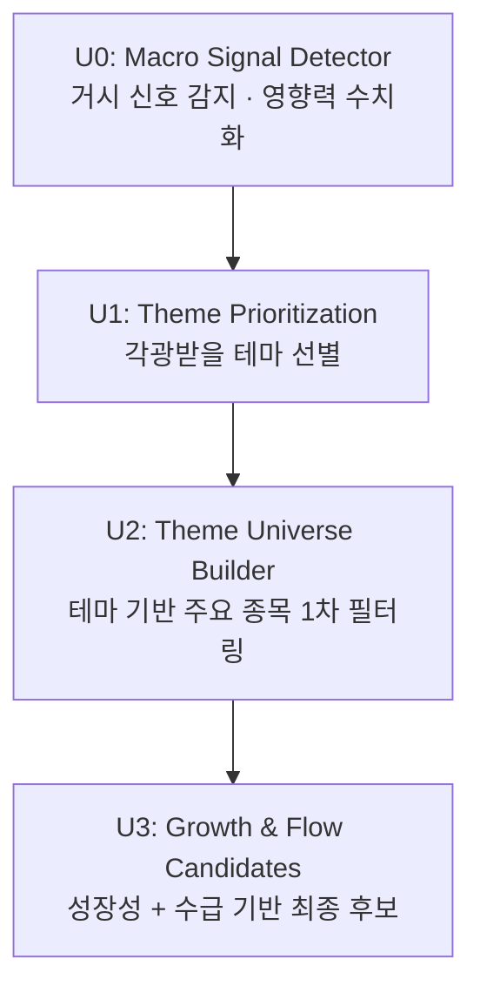

# 📄 Universe Design Document

**Project:** Pre-Trend Value 기반 자동매매 AI 시스템\
**Document:** Universe Design\
**Version:** 2026.01.14\
**Purpose:** 거시→테마→종목 추론 기반 Universe 생성 파이프라인 정의

---

# 1. Overview

본 문서는 자동매매 AI 시스템에서 활용되는 Universe 생성 구조(U0 → U1 → U2 → U3)를 정의한다.\
수집 가능한 전체 종목(Universe)을 대상으로 하지 않고,
**거시경제 신호(Macro Signal) → 테마 영향 분석 → 종목 필터링 → 성장성·수급 기반 최종 선별**의
탑다운 방식으로 효율적 Universe를 구성한다.

해당 Universe는 이후 단계(EOD 수집, Silver/Gold 레이어 분석, 전략 생성)의 핵심 입력이 된다.

---

# 2. Universe Pipeline Structure



---

# 3. U0 — Macro Signal Detector

**목적:** 시장 전체에 영향을 끼치는 거시 신호(Macro Event)를 감지하고,
신호의 영향력을 정량화하여 테마 평가의 초기 단서를 제공.

## 3.1 입력

* Macro Silver Feature:
  - 금리 / CPI / 실업률 기반 Feature (yoy, level, delta, regime)
  - Silver Macro Layer에서 생성된 일 단위 스냅샷
* 정책/정부 발표: 부양책, 규제완화, 세제혜택
* 글로벌 이슈: AI 투자, 지정학적 리스크
* 뉴스 키워드: LLM/RAG 기반 문서 요약 + 키워드 추출

## 3.2 처리

* 이벤트 분류: RATE_CUT, RATE_HIKE, STIMULUS, SUPPLY_SHOCK 등
* 영향력 산출: Rule 기반 + 모델 기반 scoring
* 불확실성 평가: confidence score 계산
* U0 단계에서 사용되는 Macro Feature는 EOD trade_date 기준 가장 최근 시점의 Silver Macro Feature를 as-of join 방식으로 스냅샷화하여 사용한다.

## 3.3 출력 예시

```json
{
  "macro_signal": "RATE_CUT",
  "impact_score": 0.82,
  "macro_snapshot_date": "2025-01-13",
  "theme_candidates": ["AI", "Semiconductor", "REITs"],
  "confidence": 0.73
}
```

---

# 4. U1 — Theme Prioritization

**목적:** U0의 신호를 기반으로 **향후 각광받을 테마(Theme Universe)**를 선별.

## 4.1 입력

* U0 macro signal outputs
* 테마별 ETF 성과(최근 1~3개월)
* ETF 자금 유입(Flow)
* 뉴스/키워드 등장 빈도
* 테마-거시 상관도 매핑

## 4.2 처리

* 테마 스코어링:

  * macro_score (U0)
  * news_score
  * etf_flow_score
  * relative_strength_score
* 테마별 종합 점수 산출

## 4.3 출력

```json
{
  "selected_themes": [
    {"theme": "Semiconductor", "score": 0.88},
    {"theme": "AI", "score": 0.75},
    {"theme": "REITs", "score": 0.72}
  ]
}
```

---

# 5. U2 — Theme Universe Builder

**목적:** U1의 테마별로 **대표 종목/ETF 기반의 1차 종목 후보군**을 구축.

## 5.1 입력

* 선택된 테마 리스트
* ETF 구성 종목 (예: SOXX, SMH, AIQ)
* 산업 분류(GICS)
* 시총/거래대금 상위 기업
* 정책/산업 구조 상 대표 기업

## 5.2 처리

* 테마별 대표주 선정
* ETF 구성 가중치 기반 상위 종목 추출
* 산업 구조 기반 대표 기업 매핑

## 5.3 출력 예시

```json
{
  "theme": "Semiconductor",
  "core_stocks": [
    "TSMC", "ASML", "NVDA", "AMD", "Applied Materials", "SK Hynix"
  ]
}
```

---

# 6. U3 — Growth & Flow Candidates

**목적:** U2 후보 종목에서 **성장성 + 수급(Flow) + 테마 모멘텀 + 가격 흐름** 기반으로
최종 Universe를 선정한다.

## 6.1 입력

* U2 core_stocks
* 재무/펀더멘털 지표 (FMP/Finnhub API 등)
* 수급 지표 (ETF 자금 유입, 기관/외국인 flows, 거래량 Spike)
* 기술적 모멘텀 지표
* 정책/테마 연관 키워드 점수

## 6.2 처리 (Composite Scoring Model)

* growth_score = 매출/영업이익/EPS 성장률
* flow_score = 거래량 Spike, OBV/MFI, ETF 유입
* theme_score = 뉴스/정책/산업 분류 기반
* momentum_score = Price Momentum(3M/6M)

최종 점수:

```
final_score = 0.35 * growth_score
            + 0.30 * flow_score
            + 0.20 * theme_score
            + 0.15 * momentum_score
```

## 6.3 출력 예시

```json
{
  "final_universe": [
    {"symbol": "NVDA", "score": 0.92},
    {"symbol": "TSMC", "score": 0.89},
    {"symbol": "ASML", "score": 0.87}
  ]
}
```

---

# 7. Universe Summary Table

| Step | Name                     | Output Type     | Description           |
| ---- | ------------------------ | --------------- | --------------------- |
| U0   | Macro Signal Detector    | macro_signal    | 거시 이벤트 감지 및 영향력 수치화   |
| U1   | Theme Prioritization     | selected_themes | 각광받을 테마 후보 선정         |
| U2   | Theme Universe Builder   | core_stocks     | 테마별 주요 종목 1차 후보군      |
| U3   | Growth & Flow Candidates | final_universe  | 성장성·수급 기반 최종 Universe |

---

# 8. Integration with Data Pipeline (EOD Ingest)

Universe 파이프라인 결과는 Step 1 EOD Ingest와 직접 연결된다.

* Bronze 레이어 EOD 수집 대상 = U3 Universe
* 수집된 EOD 데이터는 Silver EOD Feature로 변환된다.
* Gold Layer에서는:
  - U3 Universe
  - Silver EOD Feature (일 단위)
  - Silver Macro Feature (as-of join)
  를 결합하여 전략 입력용 Mart를 구성한다.
* Universe는 기본적으로 일 1회 업데이트를 기준으로 하며, Macro/정책 이벤트 발생 시 비정기 재계산을 허용한다.
* Universe 업데이트 시 EOD ingest 대상 종목 자동 변경
* Silver/Gold 레이어는 U3 중심으로 확장

---

# 9. 향후 개선 방향 (Roadmap)

* Macro Detector LLM Fine-tuning
* ETF Flow 기반 테마 강도 강화
* 분석 지표 자동 가중치 학습(XGBoost/LightGBM)
* Event-driven Universe Rebalancing
* Market Regime Detection 모델 도입
* 강화학습 기반 종목 점수 최적화

